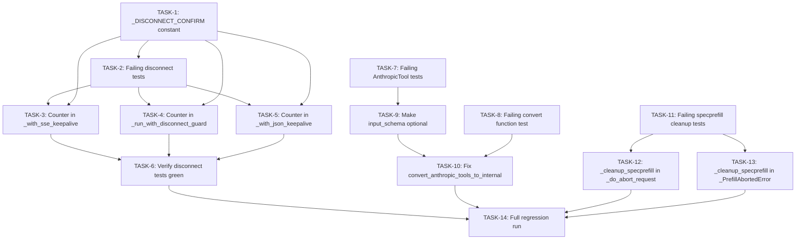

# Fix Plan: Issues #578 + #548
<!-- Generated by python-next-phase-plan pipeline -->

## Summary

Three bug fixes targeting: (A) spurious `GeneratorExit` from single-poll disconnect detection in three server keepalive/guard functions; (B) 422 errors on `/v1/messages` for Anthropic built-in tools; (C) `_OffsetAdjustedRoPE` leaking across requests when a SpecPrefill request is aborted. Fix 1 (mRoPE decode corruption on `0.3.5.dev2`) is already applied at `512c21b` — no code change needed.

---

## TASK-1: Add `_DISCONNECT_CONFIRM` constant

- **File**: `omlx/server.py`
- **Scope**: Add module-level constant `_DISCONNECT_CONFIRM = 3` before the `_with_sse_keepalive` function, near existing module-level constants (adjacent to `_KEEPALIVE_SENTINEL` at ~line 1209).
- **Depends On**: None
- **Enables**: TASK-2, TASK-3, TASK-4, TASK-5
- **Acceptance Criteria**:
  - `_DISCONNECT_CONFIRM = 3` exists at module level.
  - Importable: `from omlx.server import _DISCONNECT_CONFIRM`.
  - No existing tests break.
- **Notes**: Do not modify any function bodies. Place at module level, not inside any function.

---

## TASK-2: Write failing tests for disconnect confirmation counter

- **Files**: `tests/test_sse_keepalive.py`, `tests/test_disconnect_guard.py`, `tests/test_json_keepalive.py` (create new)
- **Scope**: Write unit tests for the not-yet-implemented debounce behavior in `_with_sse_keepalive`, `_run_with_disconnect_guard`, and `_with_json_keepalive`. All tests must FAIL against the current code (TDD red).
- **Depends On**: TASK-1
- **Enables**: TASK-3, TASK-4, TASK-5

**Import pattern** (underscore-prefixed but importable):
```python
from omlx.server import _with_sse_keepalive, _run_with_disconnect_guard, _with_json_keepalive
```

**Test class locations**:
- `_with_sse_keepalive`: add class `TestSSEKeepaliveDisconnectDebounce` in `tests/test_sse_keepalive.py`
- `_run_with_disconnect_guard`: add class `TestDisconnectGuardDebounce` in `tests/test_disconnect_guard.py`
- `_with_json_keepalive`: create `tests/test_json_keepalive.py` with class `TestJsonKeepaliveDisconnectDebounce`

**Mock request**:
```python
mock_request = AsyncMock()
mock_request.is_disconnected = AsyncMock(side_effect=[True, False, ...])
```

**Slow async generator** (for `_with_sse_keepalive`):
```python
async def slow_gen():
    event = asyncio.Event()
    await event.wait()  # never resolves during test
    yield "unreachable"
```

**Slow coroutine** (for `_run_with_disconnect_guard` and `_with_json_keepalive`):
```python
async def slow_coro():
    await asyncio.sleep(999)
    return "unreachable"
```

Use `disconnect_poll=0.01` (or `poll_interval=0.01`) in all calls to keep tests fast.

**Required test sub-cases** (3 per function = 9 tests total):

**(a) Single `True` then `False` → NOT cancelled**:
`side_effect=[True, False]` followed by the generator/coro completing. Assert task was not cancelled and normal result returned.

**(b) Three consecutive `True` → IS cancelled**:
`side_effect=[True, True, True]`. Assert function returns early (without further yields for generators, or `None` for `_run_with_disconnect_guard`).

**(c) Reset on `False` — the counter-reset behavioral test** (most important):
`side_effect=[True, True, False, True, True, True]`. Assert cancellation does NOT happen after the first two `True` (the `False` resets the counter), and DOES happen after the final three consecutive `True`. This is the key invariant of the debounce logic.

**Acceptance Criteria**:
- All 9 tests fail (RED) against current code.
- Sub-case (c) is present for all three functions.

---

## TASK-3: Implement counter in `_with_sse_keepalive`

- **File**: `omlx/server.py` (function `_with_sse_keepalive`, ~lines 1224–1301)
- **Scope**: Replace immediate-cancel disconnect block with 3-consecutive-confirmation counter.
- **Depends On**: TASK-1, TASK-2
- **Enables**: TASK-6

**Placement** (resolved): Place `disconnect_count = 0` **before** the `while True:` outer loop (not inside it). This means the counter accumulates across generator item boundaries — a disconnect signal persists even if the generator yields an item before the confirmation threshold is reached. This is the architecturally correct behavior.

```python
# Before `while True:` — counter persists across all generator items
disconnect_count = 0
keepalive_elapsed = 0.0

while True:
    task = asyncio.ensure_future(_safe_anext(ait))
    ...
    while not task.done():
        ...
        if http_request is not None:
            try:
                disconnected = await http_request.is_disconnected()
                # ↓ Replace the existing `if disconnected:` block with this:
                if disconnected:
                    disconnect_count += 1
                    if disconnect_count >= _DISCONNECT_CONFIRM:
                        logger.info("Client disconnected during streaming (is_disconnected), cancelling")
                        task.cancel()
                        try:
                            await task
                        except (asyncio.CancelledError, StopAsyncIteration):
                            pass
                        return
                    else:
                        logger.debug(
                            "is_disconnected() returned True (%d/%d), waiting for confirmation",
                            disconnect_count, _DISCONNECT_CONFIRM,
                        )
                else:
                    disconnect_count = 0
                # ↑ End of replacement
            except Exception as e:
                logger.debug(f"is_disconnected() check failed: {e}")
                pass  # preserve existing exception handling
```

**Critical**: Preserve the existing `try/except Exception` wrapper around `is_disconnected()`. Only the `if disconnected:` block (old lines 1265–1272) is replaced — do not touch the enclosing try/except.

**Acceptance Criteria**:
- `disconnect_count = 0` placed before `while True:`.
- `else: disconnect_count = 0` branch added (new — not in current code).
- Debug log message text matches exactly as shown.
- Existing `try/except Exception` around `is_disconnected()` preserved.
- TASK-2 sub-cases (a), (b), (c) for `_with_sse_keepalive` all pass.

---

## TASK-4: Implement counter in `_run_with_disconnect_guard`

- **File**: `omlx/server.py` (function `_run_with_disconnect_guard`, ~lines 1304–1330)
- **Scope**: Same 3-consecutive pattern; single loop, no try/except around `is_disconnected()`.
- **Depends On**: TASK-1, TASK-2
- **Enables**: TASK-6

```python
disconnect_count = 0  # declare above the while loop

while not task.done():
    ...
    if await http_request.is_disconnected():
        disconnect_count += 1
        if disconnect_count >= _DISCONNECT_CONFIRM:
            task.cancel()
            try:
                await task
            except (asyncio.CancelledError, StopAsyncIteration):
                pass
            return task.result() if not task.cancelled() else None
        else:
            logger.debug(
                "is_disconnected() returned True (%d/%d), waiting for confirmation",
                disconnect_count, _DISCONNECT_CONFIRM,
            )
    else:
        disconnect_count = 0
```

**Acceptance Criteria**:
- `disconnect_count = 0` declared before `while not task.done()`.
- Same 3-strike pattern; no try/except added (match existing style).
- TASK-2 sub-cases (a), (b), (c) for `_run_with_disconnect_guard` all pass.

---

## TASK-5: Implement counter in `_with_json_keepalive`

- **File**: `omlx/server.py` (function `_with_json_keepalive`, ~lines 1333–1383)
- **Scope**: Same 3-consecutive pattern; single loop, preserve existing try/except around `is_disconnected()`.
- **Depends On**: TASK-1, TASK-2
- **Enables**: TASK-6

Place `disconnect_count = 0` before `while not task.done()`. Apply the same counter pattern as TASK-3's replacement block, inside the existing `try/except` that wraps the disconnect check. Preserve the `except Exception: pass` that already exists.

**Acceptance Criteria**:
- Same 3-strike pattern; existing try/except preserved.
- TASK-2 sub-cases (a), (b), (c) for `_with_json_keepalive` all pass.

---

## TASK-6: Verify all disconnect debounce tests pass

- **Scope**: Run SSE/guard/keepalive test files, confirm green.
- **Depends On**: TASK-3, TASK-4, TASK-5
- **Command**: `pytest tests/test_sse_keepalive.py tests/test_disconnect_guard.py tests/test_json_keepalive.py -v`
- **Acceptance Criteria**: Zero failures, no regressions.

---

## TASK-7: Write failing tests for `AnthropicTool` optional `input_schema`

- **File**: `tests/test_anthropic_models.py`, class `TestAnthropicTool`
- **Scope**: Tests for the not-yet-implemented optional `input_schema`. Must FAIL against current code.
- **Depends On**: None
- **Enables**: TASK-9

**Sub-case (a) — built-in tool without `input_schema`**:
```python
def test_builtin_tool_without_input_schema(self):
    tool = AnthropicTool.model_validate({"name": "web_search"})
    assert tool.name == "web_search"
    assert tool.input_schema is None
```

**Sub-case (b) — extra `type` field silently dropped**:
```python
def test_builtin_tool_with_type_field_ignored(self):
    tool = AnthropicTool.model_validate({"name": "web_search", "type": "web_search_20250305"})
    assert tool.name == "web_search"
    assert tool.input_schema is None
    # Verify `type` is NOT accessible as a model field
    assert "type" not in tool.model_fields
```

Both currently fail because `input_schema` is required. After TASK-9, both pass.

**Acceptance Criteria**: Both tests fail (RED) against current code.

---

## TASK-8: Write failing test for `convert_anthropic_tools_to_internal` with `None` schema

- **File**: `tests/test_api_utils.py`, class `TestConvertAnthropicToolsToInternal`
- **Scope**: Test that `None` input_schema is coerced to `{}` in the convert function output.
- **Depends On**: None
- **Enables**: TASK-10

```python
def test_convert_tool_with_none_input_schema(self):
    tool_dict = {"name": "web_search", "input_schema": None}
    result = convert_anthropic_tools_to_internal([tool_dict])
    assert result[0]["function"]["parameters"] == {}
```

Use a plain dict (not `AnthropicTool`) to isolate from the model change. Currently fails because `dict.get("input_schema", {})` returns `None` when key exists with value `None`.

**Acceptance Criteria**: Test fails (RED) against current code.

---

## TASK-9: Make `AnthropicTool.input_schema` optional

- **File**: `omlx/api/anthropic_models.py`, line 119
- **Scope**: Single field type change.
- **Depends On**: TASK-7
- **Enables**: TASK-10

**The only change**:
```python
# Before:
input_schema: dict[str, Any]
# After:
input_schema: dict[str, Any] | None = None
```

**Do NOT**:
- Add a `type` field (Pydantic v2 `BaseModel` default `extra="ignore"` silently drops unknown fields)
- Import `ConfigDict` (not needed — Pydantic v2 default is already `extra="ignore"`)
- Change any imports

**Acceptance Criteria**:
- `AnthropicTool.model_validate({"name": "web_search"})` succeeds, `input_schema is None`.
- Extra `type` field silently dropped; `"type" not in tool.model_fields` holds.
- Existing tests with `input_schema` provided still pass (backward compatible).
- TASK-7 tests pass (GREEN).
- No new type-checker errors.

---

## TASK-10: Fix `convert_anthropic_tools_to_internal` for `None` `input_schema`

- **File**: `omlx/api/anthropic_utils.py`, line ~710
- **Scope**: One-line fix.
- **Depends On**: TASK-8, TASK-9

```python
# Before:
"parameters": tool_dict.get("input_schema", {}),
# After:
"parameters": tool_dict.get("input_schema") or {},
```

The `or {}` coercion handles both `None` (key present with `None` value) and missing key (where `get()` returns `None`).

**Acceptance Criteria**:
- TASK-8 test passes (GREEN).
- All existing `TestConvertAnthropicToolsToInternal` tests still pass.
- No new type-checker errors.

---

## TASK-11: Write failing tests for `_cleanup_specprefill` in abort path

- **File**: `tests/test_scheduler.py`
- **Scope**: Three test sub-cases verifying cleanup on abort/error paths. Must FAIL against current code.
- **Depends On**: None
- **Enables**: TASK-12, TASK-13

Follow the existing `TestAbortRequest` setup pattern. The scheduler needs a request in `scheduler.requests` to avoid early return in `_do_abort_request`.

**Sub-case (a) — abort of active specprefill request calls cleanup**:
```python
def test_abort_calls_cleanup_specprefill(self):
    # ... scheduler setup with request "req-1" ...
    scheduler._specprefill_active_request_id = "req-1"
    with patch.object(scheduler, "_cleanup_specprefill") as mock_cleanup:
        scheduler._do_abort_request("req-1")
    mock_cleanup.assert_called_once_with("req-1")
```

**Sub-case (b) — abort with no active specprefill does not crash**:
```python
def test_abort_no_specprefill_active_does_not_fail(self):
    # ... scheduler setup with request "req-2" ...
    scheduler._specprefill_active_request_id = None
    scheduler._do_abort_request("req-2")  # must not raise
```

**Sub-case (c) — `_PrefillAbortedError` handler clears active specprefill** (simulated inline):
```python
def test_prefill_abort_cleans_specprefill(self):
    # ... scheduler setup ...
    scheduler._specprefill_active_request_id = "req-1"
    with patch.object(scheduler, "_cleanup_specprefill") as mock_cleanup:
        # Simulate the handler body (what TASK-13 will add):
        scheduler._batch_generator = None
        scheduler._reschedule_running_requests()
        if scheduler._specprefill_active_request_id is not None:
            scheduler._cleanup_specprefill(scheduler._specprefill_active_request_id)
    mock_cleanup.assert_called_once_with("req-1")
    # NOTE: Do NOT assert _specprefill_active_request_id is None here —
    # the mock does not execute the real method body, so the attribute
    # is not actually cleared. Assert only that the mock was called.
```

**Acceptance Criteria**: All three sub-cases fail (RED) against current code (before TASK-12/13).

---

## TASK-12: Add `_cleanup_specprefill` in `_do_abort_request`

- **File**: `omlx/scheduler.py`, method `_do_abort_request` (~line 2615)
- **Scope**: One-line insertion.
- **Depends On**: TASK-11
- **Enables**: TASK-14

Insert after `self._cleanup_output_parser_session(request_id)` and before `if hasattr(self.model, 'clear_vlm_position_state'):`:

```python
        self._cleanup_output_parser_session(request_id)

        # Clean up SpecPrefill RoPE patches if this was the active specprefill request
        self._cleanup_specprefill(request_id)

        # Clean up VLM adapter state to prevent contamination
        if hasattr(self.model, 'clear_vlm_position_state'):
```

`_cleanup_specprefill` already guards on `self._specprefill_active_request_id == request_id` — safe no-op for non-SpecPrefill requests.

**Acceptance Criteria**:
- TASK-11 sub-cases (a) and (b) pass.
- All existing `TestAbortRequest` tests pass.

---

## TASK-13: Add `_cleanup_specprefill` in `_PrefillAbortedError` handler

- **File**: `omlx/scheduler.py`, `step()` method, `except _PrefillAbortedError:` block (~line 3638)
- **Scope**: Three-line insertion.
- **Depends On**: TASK-11
- **Enables**: TASK-14

Insert after `self._reschedule_running_requests()`:

```python
        except _PrefillAbortedError:
            ...
            self._batch_generator = None
            failed_ids = self._reschedule_running_requests()
            # Clean up SpecPrefill RoPE if the active specprefill request was interrupted
            if self._specprefill_active_request_id is not None:
                self._cleanup_specprefill(self._specprefill_active_request_id)
            for rid in failed_ids:
                ...
```

**Why `_specprefill_active_request_id` and not a request ID**: In this handler we are in a batch context, not aborting a single request. The active specprefill request (if any) must be cleaned up regardless of which request triggered the abort. Defense-in-depth: `_do_abort_request` (TASK-12) will also clean up when `_process_pending_aborts` runs next, but this handles cases where prefill is interrupted for non-abort reasons (e.g. memory guard).

**Acceptance Criteria**:
- TASK-11 sub-case (c) passes.
- No other `except` handlers modified.
- Placement verified relative to any boundary snapshot cleanup lines in the same block.

---

## TASK-14: Full regression test run

- **Scope**: Final verification across entire test suite.
- **Depends On**: TASK-6, TASK-10, TASK-12, TASK-13
- **Command**: `pytest tests/ -v`
- **Acceptance Criteria**: Zero failures, zero errors. All new tests from TASK-2, TASK-7, TASK-8, TASK-11 are green.

---

## Dependency Graph



## Execution Phases

| Phase | Tasks | Notes |
|-------|-------|-------|
| Phase 1 (parallel) | TASK-1, TASK-7, TASK-8, TASK-11 | No dependencies — all test-writing and constant-definition |
| Phase 2 (parallel) | TASK-2, TASK-9, TASK-12, TASK-13 | TASK-2 depends on TASK-1; TASK-9 on TASK-7; TASK-12/13 on TASK-11 |
| Phase 3 (parallel) | TASK-3, TASK-4, TASK-5, TASK-10 | Disconnect implementations (depend on TASK-1+2); TASK-10 depends on TASK-8+9 |
| Phase 4 (parallel) | TASK-6 | Verify disconnect tests |
| Phase 5 | TASK-14 | Full regression run |

## Risk & Ambiguity Flags

- **TASK-2 / TASK-3**: The `disconnect_count` is placed before `while True:` (persists across generator yields). This deliberately deviates from resetting per-item — a disconnect signal accumulates even if the server is actively streaming tokens.
- **TASK-9**: Pydantic v2 `BaseModel` default `extra="ignore"` confirmed — no `ConfigDict` needed.
- **TASK-11 sub-case (c)**: Mock `_cleanup_specprefill` and assert `mock_cleanup.assert_called_once_with("req-1")` only. Do NOT assert `_specprefill_active_request_id is None` — the mock doesn't execute the real method, so the attribute won't actually be cleared.
- **TASK-13**: Scheduler's `_do_abort_request` has complex internal state. Mock `mx.synchronize`, `generation_stream`, and `_remove_uid_from_active_batch` as needed to prevent crashes on unrelated code paths before reaching the `_cleanup_specprefill` insertion point.
